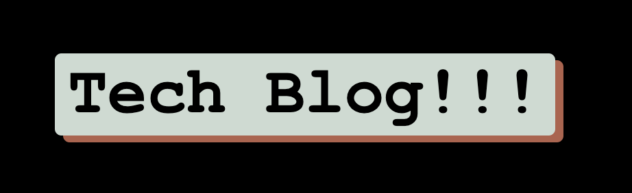
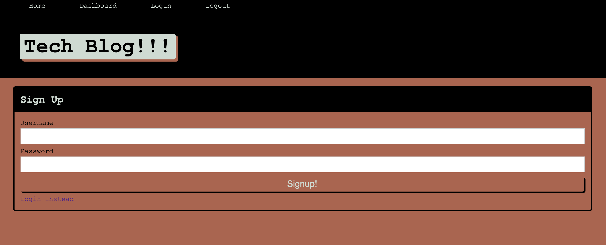
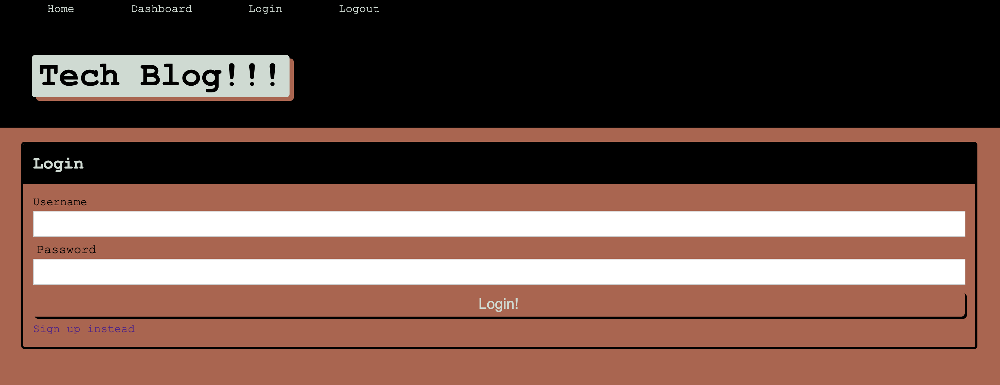
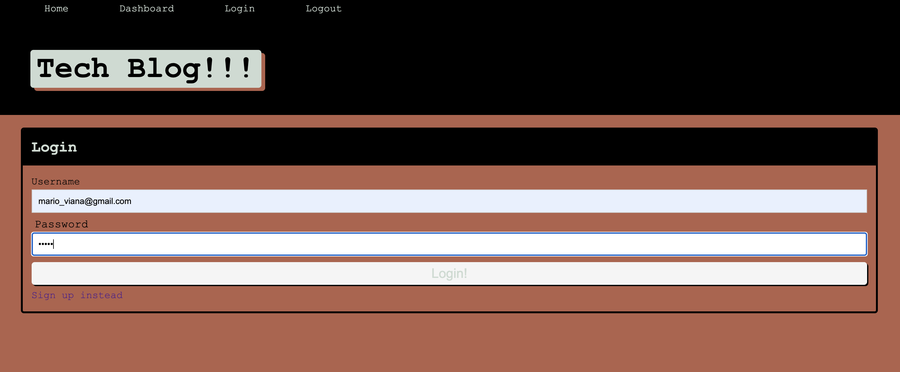
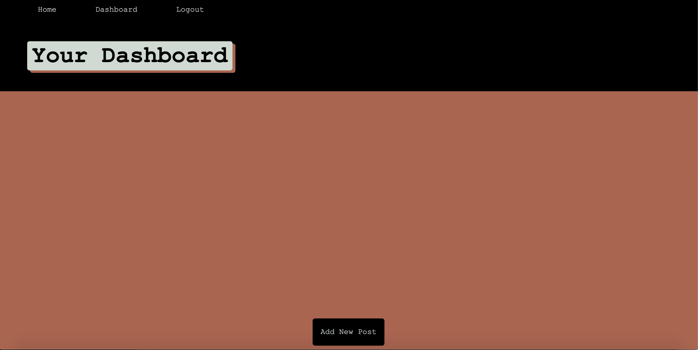
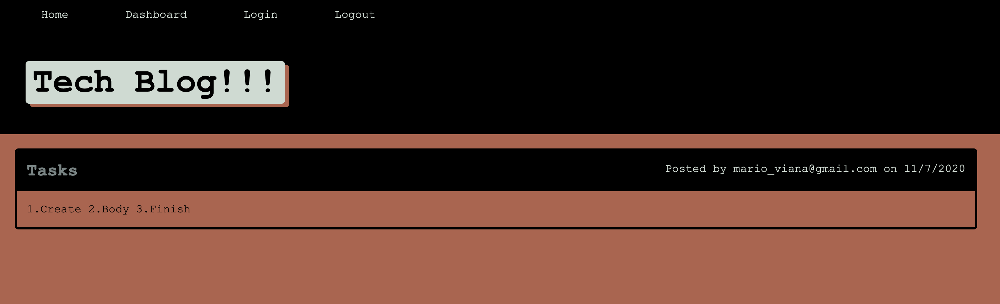
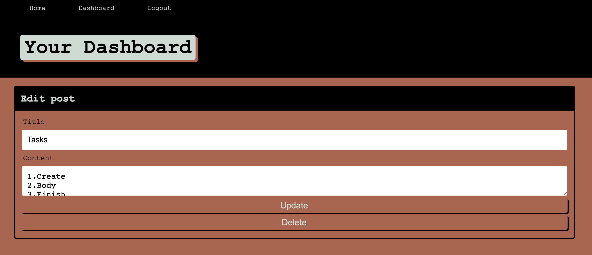

# 

## Description 
This app is for all those who want to be informed about what is happening in the world of technology, here you can enter as a user and leave us your comment, you can also update your comment or delete it, this is for sure because we validate our page with a password every time you enter this page.

## Table of Contents

- [Installation](#installation)
- [Usage](#usage)
- [Contributing](#contributing)
- [Tests](#tests)
- [License](#license)
- [Deployed Application](#Deployed-Application)
- [ScreenShots](#screen-shot)
- [Questions](#questions)

## Installation

Clone this repository,run `npm i` to download and install the dependencies: 
    
    * bcrypt: 5.0.0.
    * connect-session-sequelize: 7.0.4.
    * dotenv": 8.2.0. 
    * epress: 0.0.1-security.
    * express: 4.17.1.
    * express-handlebars: 5.2.0.
    * express-session: 1.17.1.
    * mysql2: 2.2.5.
    * sequelize: 6.3.5.

## Usage 

After installing start the server by running `npm start`.

## Contributing

Pull requests are welcome. For major changes, please open an issue first to discuss what you would like to change.

Please make sure to update tests as appropriate.

## Tests

## Deployed Application

 NO YET!!!

## Screen-Shots
# Main

# Signup

# Login

# Dashboard

# Logout

## Questions

Contact me:

* Email: marioviana07@gmail.com
* Github: www.github.com/marioviana07
* Linkedin: https://www.linkedin.com/in/mario-viana-molina-5519771a9?lipi=urn%3Ali%3Apage%3Ad_flagship3_profile_view_base_contact_details%3BaUXf4KZkTheUszEE3t3j4g%3D%3D